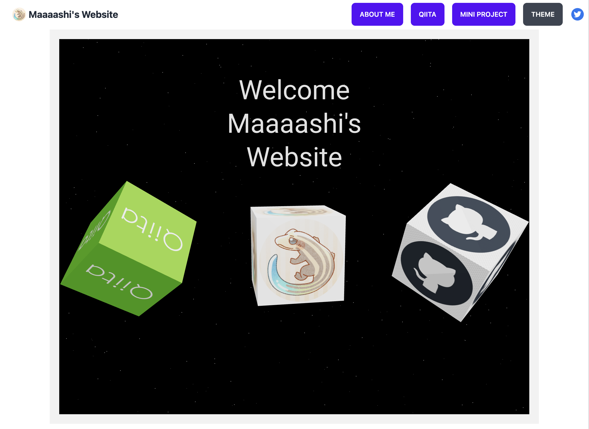
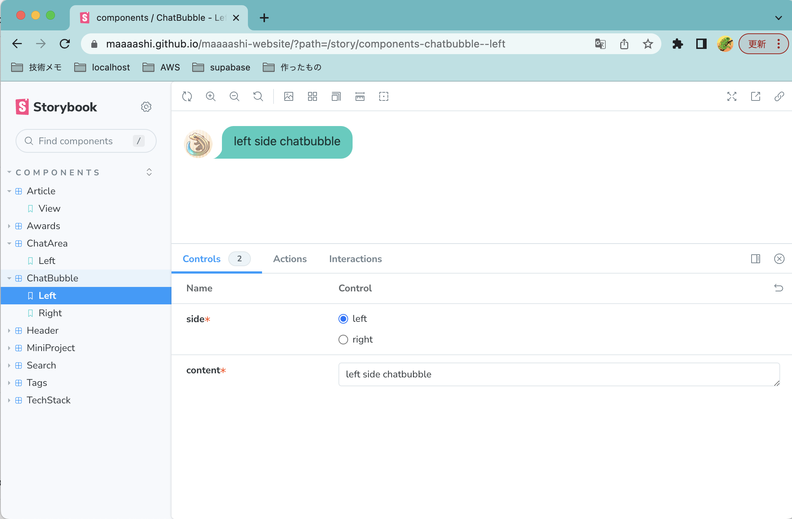

# Maaaashi's Website



<div align="center">Github repository containing the source code for Maaaashi's Website.</div>

- [Maaaashi's Website](#maaaashis-website)
- [Installation](#installation)
- [Usage](#usage)
- [Storybook](#storybook)

# Installation

```bash
$ git clone https://github.com/maaaashi/maaaashi-website.git
$ cd maaaashi-website
$ npm install
```

# Usage

```bash
$ make dev
```

Access to http://localhost:3000

# Storybook



https://maaaashi.github.io/maaaashi-website/
